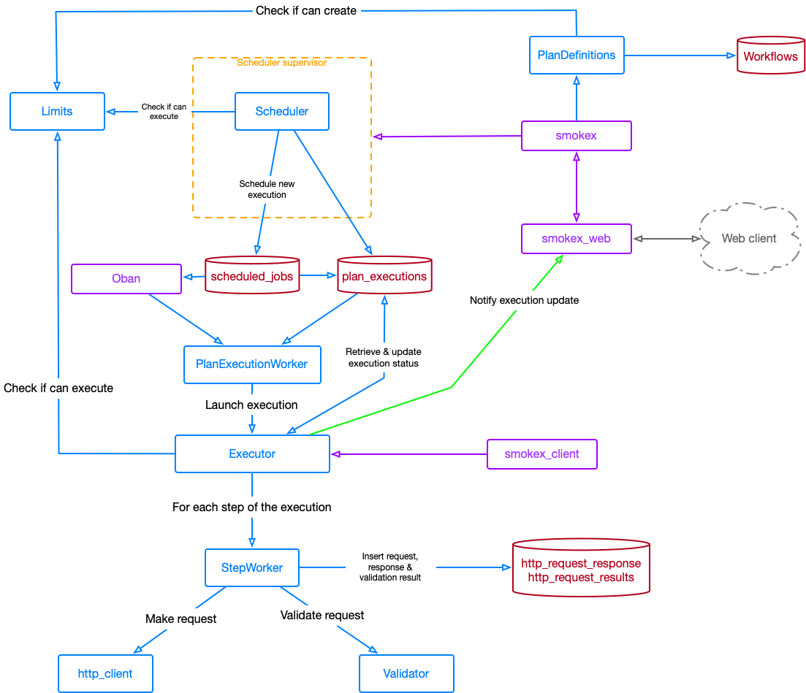

# Smokex.Umbrella

<!-- vim-markdown-toc GFM -->

* [Deployment](#deployment)
  * [Heroku](#heroku)
    * [Logs](#logs)
  * [Run a release locally](#run-a-release-locally)
    * [Need to know](#need-to-know)
* [Architecture](#architecture)
* [Why Smokex?](#why-smokex)
  * [Experience situations where Smokex tests were needed](#experience-situations-where-smokex-tests-were-needed)
* [Uses cases (smoke tests & HTTP automation)](#uses-cases-smoke-tests--http-automation)
  * [Distributed application](#distributed-application)

<!-- vim-markdown-toc -->

## Deployment

### Heroku

This project is deployed to Heroku using Docker containers.

* Login into Heroku registry `heroku container:login`
* Build and push an image `heroku container:push web`

#### Logs

```bash
heroku drains:add 'https://http-intake.logs.datadoghq.com/v1/input/<DD_APY_KEY>?ddsource=heroku&service=smokex&host=gigalixir' -a smokex

```

### Run a release locally

There are multiple environment variables that are expected to be set in order to
run a release:

```bash
SECRET_KEY_BASE=kGXrNEYUVAm2zOpB8UQMRfK+JkDnqFcH4WOcM8nYApN/fMWVJoQPMGqrUTwv15w5 DATABASE_HOSTNAME=postgres-free-tier-1.gigalixir.com DATABASE_USERNAME=test DATABASE_PASSWORD=test DATABASE_NAME=test PORT=4000 POOL_SIZE=1 DATABASE_URL="" STRIPE_API_KEY="" STRIPE_SIGNING_SECRET="" _build/prod/rel/smokex/bin/smokex start_iex
```

#### Need to know

* The Stripe button to buy a subscription requires environment variables to be
    configured or it will throw the `unexpected item shape` error if not.
* The Slack integration also requires a runtime configuration therefore it will
    fail locally. Also, the redirection done by Slack is to production host.

## Architecture




## Why Smokex?

* Not everybody has CI pipelines
* You don't want to mix CI executions with smoke testing
* You want a clear way to identify downtimes, errors...
* Monitor any legacy project with little effort
* But also easily run smoke tests on a new project to validate deployments
* Can give access to third parties without to have access to source code o
    sensitive tools
* Won't require technical knowledge
* Won't be coupled to any testing library and making changes transparent to the
    repo

### Experience situations where Smokex tests were needed

* Empty deployment with health check workng ok but actual endpoints were all
    failing
* App requires some environment variables set before start, they were available
    on deployment so all went good. After some days the app got restarted but
    the variables were not available anymore (were managed by a third party
    service), entering in a crash loop and no one noticing.

## Uses cases (smoke tests & HTTP automation)

* Schedule a HTTP request to keep Heroku instances up.
* Send a ping request to ensure a system is reachable.
* Retrieve a information from currency prices and send it to your server to get update value #nocode

### Distributed application

The current application is a single monolith, although it uses umbrella
applications running in a single node.

The goal is release several application instances with role _worker_ that will
be executing the actions triggered by an orchestrator, which can be considered
as _producer_.

Considerations for distributed architecture:

* The project is using `quantum` to schedule jobs, it can use mnesia to store the
    schedule jobs but keep in mind the network partition problems. This
    application uses Cachex already so consider implementing a backend for it
    (https://hexdocs.pm/quantum/configuration.html#persistent-storage). To solve
    this problem we can have a _producer_ node that will be handling the
    schedule jobs and when the node taking the role starts just puts all the
    scheduled jobs in a cache, so everytime the _producer_ node dies the new one
    will regenerate the state.
* Oban might need extra configurations for distributed systems, need to check
